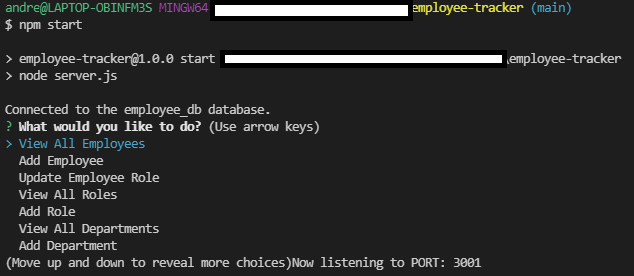

# Employee Tracker

## Description

Manage your company's employee database with this app. Check all the employees, roles and departments within your company as well as adding or updating them using only your terminal. You just need to answer a couple of questions and you are all set.

## Prompt Picture

## Getting Started

These instructions will get you a copy of the project up and running on your local machine for development and testing purposes.

* Click on the green button named Code on github and copy the URL of the repository.
* Use the command git clone (repository's URL) to clone all existing project on your local machine.
* Start your testing opening your terminal or command line and going to the repository location on your machine.
* Type the command "npm install" to get the libraries used in this project.
* Type the command "npm start" to start managing your company's employee database.
* Fill out all the questions for each prompt.
* After answering all the questions you can get the list of departments, roles or employees with all the updates you've done.
* Congratulations! You managed your employee's database with only a few and simple steps and with no coding.

## Walkthrough Video

* [Link To Video](https://watch.screencastify.com/v/pY5V7yvZvn5eEP0GD1Ej)

## Prerequisites

* Git
* Node.js
* NPM
* Inquirer
* MySQL

## Installing

* Fork the project to get your own copy of the repository.
* Clone the repository.
* Follow the steps above to generate your own Team Profile Website.

## Built With

* [Javascript](https://developer.mozilla.org/en-US/docs/Web/javascript)
* [Node.js](https://nodejs.org/en/)
* [NPM](https://docs.npmjs.com/)
* [Inquirer](https://www.npmjs.com/package/inquirer)
* [MySQL](https://www.mysql.com/)

## Link of Repository

* [See Repository](https://github.com/andresliu22/employee-tracker)

## Authors

* **Andres Liu** 

## Contacts

- [Link to Portfolio Site](https://andresliu22.github.io/updated-portfolio/)
- [Link to Github](https://github.com/andresliu22/)
- [Link to LinkedIn](https://www.linkedin.com/in/andresliu22/)

## License

This project is licensed under the ISC License.

## Acknowledgments

* Always do some research to get the best possible way to code anything.
* Make the website and code easy to read for viewers and other developers by using brief comments.
* Be use to commit to get an insight of what you have done for each progress you make.

